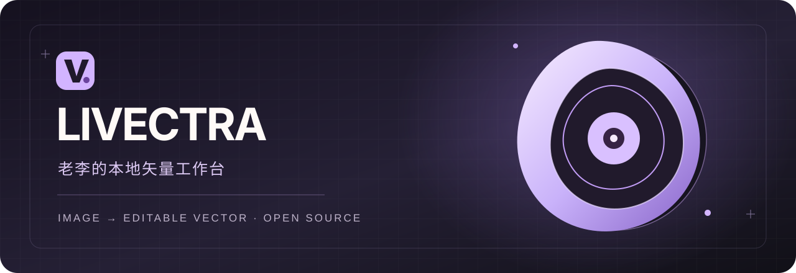
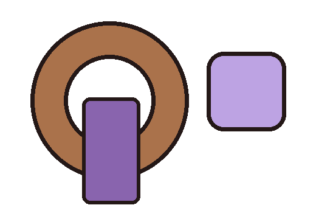
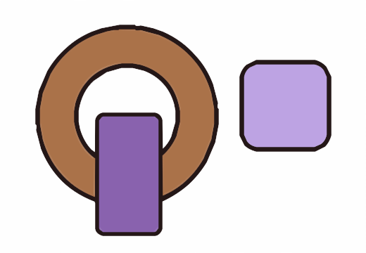
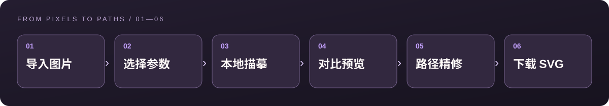
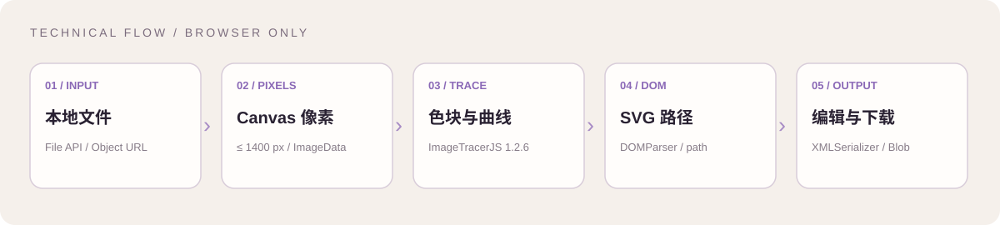

# LIVECTRA · 老李

<p align="center">
  
</p>

<p align="center">
  <strong>把图片变成可以继续编辑的矢量路径。</strong><br>
  浏览器本地运行 · 无需账号 · 无需上传 · 免费开源
</p>

<p align="center">
  <a href="https://oldleeo.github.io/laoli-livectra/">在线使用</a> ·
  <a href="#三分钟上手">操作教程</a> ·
  <a href="docs/TECHNICAL.md">技术详解</a> ·
  <a href="LICENSE">MIT 许可证</a>
</p>

---

## 这是什么

**LIVECTRA** 是老李（[Oldleeo](https://github.com/Oldleeo)）发起的开源图片转 SVG 工具。它读取 PNG、JPG、WebP、GIF 或 BMP，在浏览器内做颜色归纳和轮廓追踪，生成由真实 `<path>` 构成的 SVG。你可以在网页里调整参数、切换原图与矢量图、给单条路径改色或删除它，最后下载 SVG，并在 Adobe Illustrator 等矢量编辑软件中继续加工。

这个项目的目标是提供一个**可编辑的矢量初稿**。它不会自动理解物件结构，也不会把复杂插画变成与人工重绘完全相同的分层设计稿。网页中使用的“AI 产品”视觉语言是界面设计；当前转换引擎是确定性的本地描摹算法，**不调用 AI 生图或云端模型**。

## 效果预览

以下图片是本仓库自己绘制的公开示例。左边是 PNG，右边是转换后可检查、可编辑的 SVG；实际效果会随图片内容与参数变化。

| 输入：PNG 位图 | 输出：SVG 路径 |
| :---: | :---: |
|  |  |

> 输出图是自动描摹示例，不是手工重绘结果。放大、删减、改色可以继续在网页或 Illustrator 中完成。

## 三分钟上手

1. 打开 **[LIVECTRA 在线工作台](https://oldleeo.github.io/laoli-livectra/)**，滚动至“从这里，开始重绘”。
2. 点击或拖入一张图片。支持 PNG、JPG、WebP、GIF、BMP；单个文件上限为 **10 MB**。第一次体验可点“**先用示例试一试**”。
3. 选择预设：“**精致插画**”适合一般图形，“**丰富细节**”保留更多小块，“**极简图形**”减少细碎路径。再按需要调整色彩层次与曲线精度。
4. 点击“**生成矢量图**”。可切换“原图 / 矢量预览”观察差异。若形状过碎，降低曲线精度或颜色数；若细节不足，则提高它们并重新生成。
5. 点击矢量预览中的色块，使用下方控件**改色或删除路径**；“撤销”可恢复最近的改动，最多保留 20 步。
6. 点击“**下载 SVG**”。在 Adobe Illustrator 中选择“文件 → 打开”载入 `.svg`；如需要原生 `.ai`，再执行“文件 → 另存为”，选择 Adobe Illustrator 格式。

<p align="center"></p>

### 预设怎么选

| 预设 | 初始颜色数 | 曲线精度 | 适用场景 |
| --- | ---: | ---: | --- |
| 精致插画 | 16 | 3 / 5 | 简单插画、图标、色块清晰的素材 |
| 丰富细节 | 30 | 5 / 5 | 需要保留更多局部层次的图片 |
| 极简图形 | 8 | 2 / 5 | 标志草稿、形状概括、低色彩图形 |

摄影照片、复杂渐变、细小文字和透明柔边可能生成大量路径，通常还要在矢量软件中整理。

## 本地运行与离线使用

仓库是纯静态页面，没有构建步骤或后端。克隆仓库后，在项目根目录启动任意静态文件服务：

```bash
git clone https://github.com/Oldleeo/laoli-livectra.git
cd laoli-livectra
python -m http.server 8080
```

访问 `http://localhost:8080`。如果系统没有 Python，也可以用其他静态服务器。`vendor/imagetracer.js` 已随仓库提供，因此克隆后无需在线获取转换引擎。网页资源加载完成后，图片转换可以断网进行；关闭网页后要再次离线使用，建议运行上述本地副本。

## 技术实现

<p align="center"></p>

1. **读取与解码**：`File API` 接收文件，`URL.createObjectURL()` 生成仅供本页读取的地址，浏览器解码图片。
2. **控制尺寸**：以最长边 **1400 px** 为上限，按比例绘制到 Canvas，避免极大图片耗尽浏览器内存。
3. **像素转路径**：取出 `ImageData`，交给 [ImageTracerJS 1.2.6](https://github.com/jankovicsandras/imagetracerjs)。颜色量化把近似颜色归为有限色块，轮廓跟踪与曲线拟合将色块转换成路径。
4. **整理结果**：解析引擎输出，重新生成只含 SVG 根元素和 `<path>` 的结果。下载文件不含 `<image>` 嵌入位图，也不依赖系统字体。
5. **网页精修**：点击路径选中；颜色修改、删除和撤销都直接操作当前 SVG DOM。下载时用 `XMLSerializer` 序列化。

更详细的参数映射、文件结构、性能与隐私说明见 **[技术详解](docs/TECHNICAL.md)**。

## 能做什么、暂时做不到什么

| 能力 | 当前状态 |
| --- | --- |
| 图片转真正的 SVG 路径 | ✅ 支持 |
| 浏览器本地处理、无需上传图片 | ✅ 支持 |
| 调整颜色数量和曲线精度 | ✅ 支持 |
| 点击路径改色、删除、撤销 | ✅ 支持 |
| 直接生成原生 `.ai` | 暂不支持；可用 Illustrator 打开 SVG 后另存 |
| 自动识别文字并保留可编辑文本 | 暂不支持；文字会成为图形轮廓 |
| 自动生成语义分层或人工重绘质量 | 暂不支持 |
| 动图逐帧矢量化 | 暂不支持；GIF 按静帧处理 |

## 隐私与版权

- 转换在你的浏览器里执行；本项目没有图片上传接口，上传控件只把文件交给本地页面脚本。GitHub Pages 负责提供静态网页文件。
- 请确保对输入图片及后续发布、商用行为拥有相应权利。本仓库没有收录用户提供的参考图片或私人作品。
- LIVECTRA 原创代码、界面和文档：**© 2026 老李（Oldleeo）**，采用 [MIT License](LICENSE)。
- `vendor/imagetracer.js` 为 András Jankovics 的 ImageTracerJS 1.2.6，采用 [The Unlicense](vendor/LICENSE-ImageTracer)；其权利归属不并入上述 MIT 著作权声明。

## 参与项目

发现问题或有功能建议，欢迎提交 [Issue](https://github.com/Oldleeo/laoli-livectra/issues)。提交代码可先 Fork、创建分支，再发 Pull Request；请描述改动动机、操作方式，以及在浏览器中的验证结果。页面由 [GitHub Actions](.github/workflows/pages.yml) 自动部署至 GitHub Pages，推送到 `main` 后会触发部署。

---

<p align="center">Made with care by <strong>老李 · LIVECTRA</strong></p>
